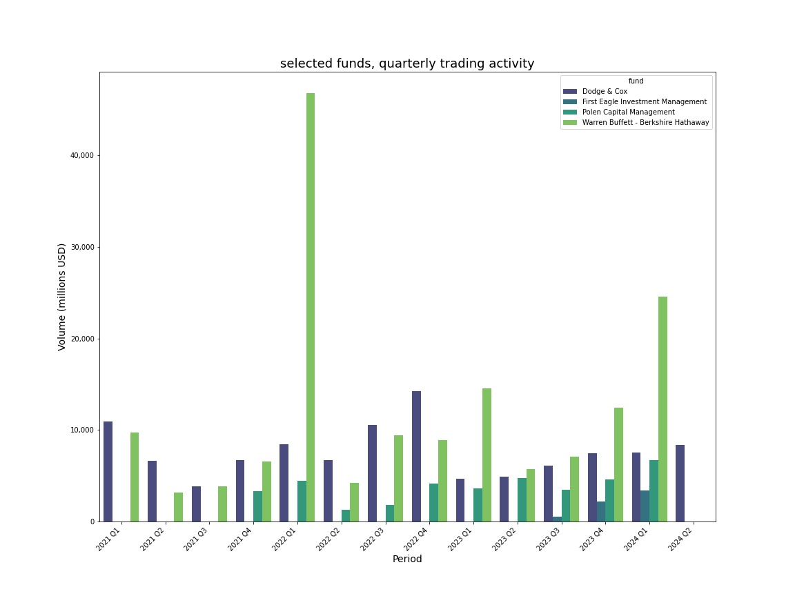
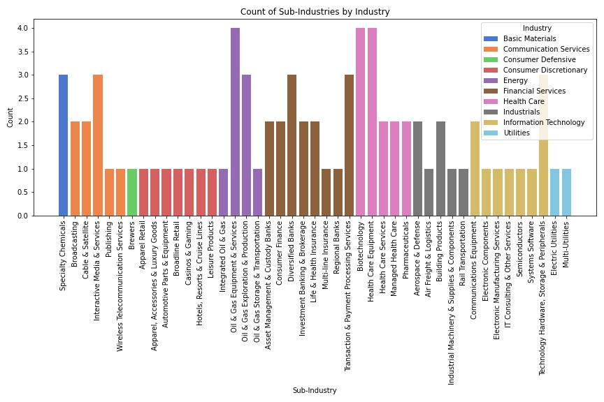

# superinvestors-database
Analysis of superinvestors transactions for the last 5 years extracted from Dataroma.com, a platform that tracks the investments of renowned fund managers like Warren Buffett, Bill Ackman, and others.

Here are some of the uses of this database;
1. Study superinvestors' portfolio adjustments each quarter to detect trends in their buying and selling choices.
2. Find out which funds are the most engaged in activities and how they have positioned themselves in various stocks over the years.
3. Examine how these investors have exchanged stocks of particular companies like NVIDIA and AMD, showcasing the top contenders.
4. Determine how investors distribute their investments among various industries and sub-categories, enabling you to recognize trends within sectors.

With this database, you can gain unique insights into how the best investors manage their portfolios and apply that knowledge to your own investment strategy.

# data visualizations

These are some graphical examples of uses for the superinvestors database:

## Selected funds, quarterly trading activity 

This chart illustrates the trading activity for the selected funds

  

## Activity by Industry

This chart illustrates the sub-industry activity by industry 

## Top 3 investors for NVIDIA activity 

This chart illustrates the trading activity for a selection of funds

  

## Top 3 investors for AMD activity 

This chart illustrates the trading activity for a selection of funds

  

## Total Activity by Fund

This chart shows the total activity by fund, displaying the top 20 funds by total shares.

