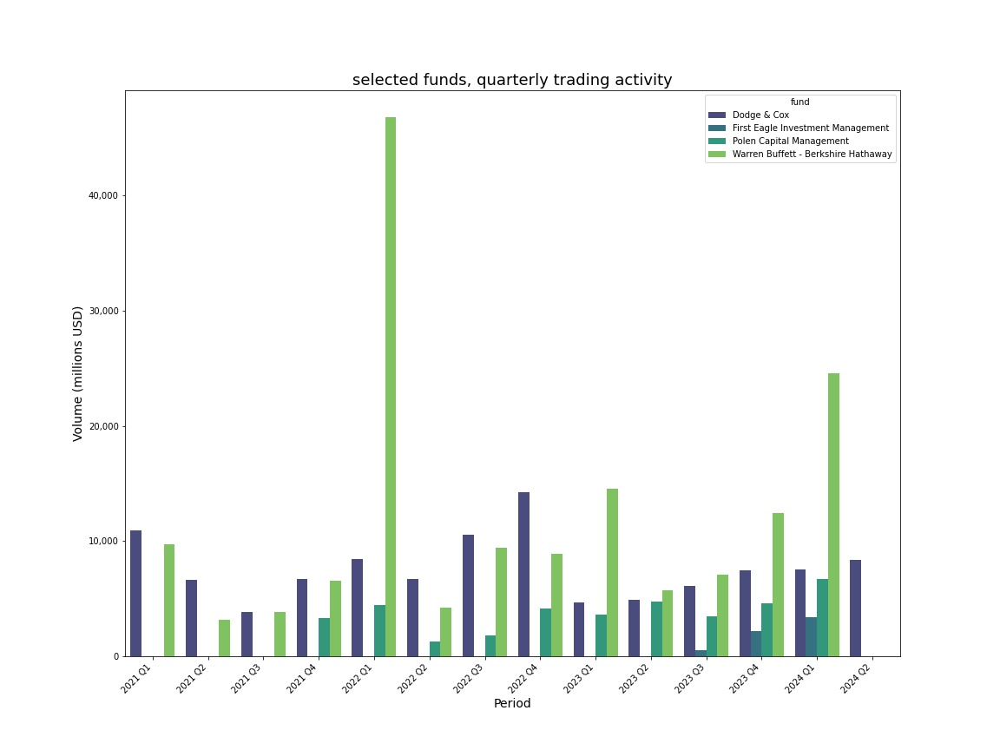
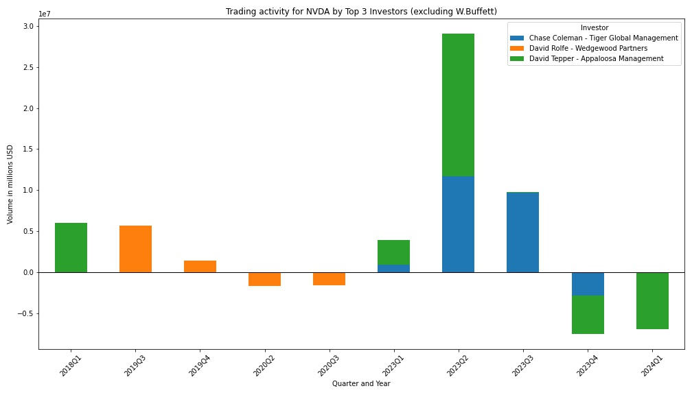
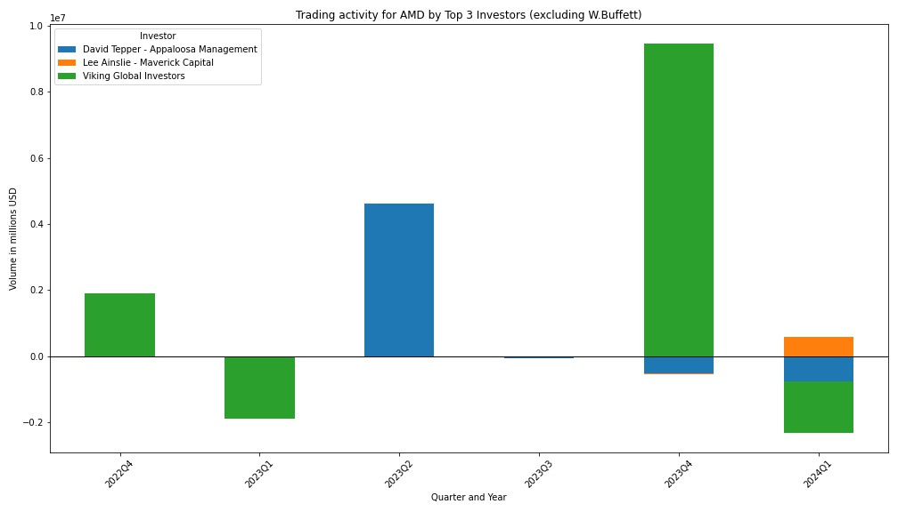
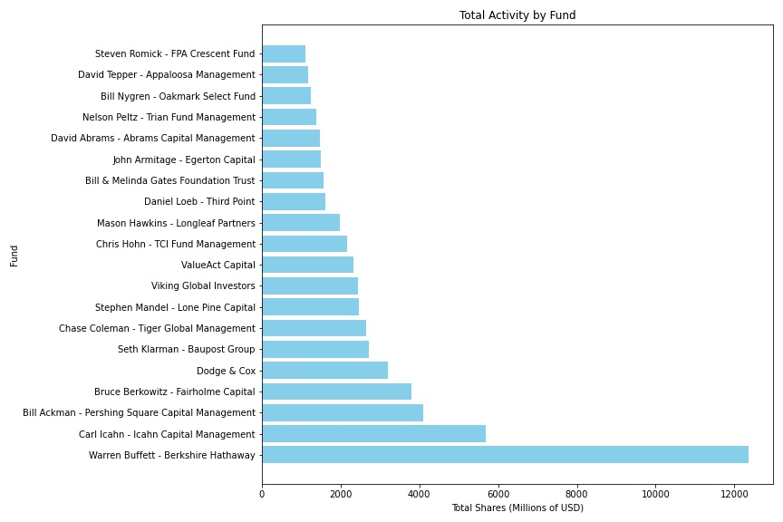
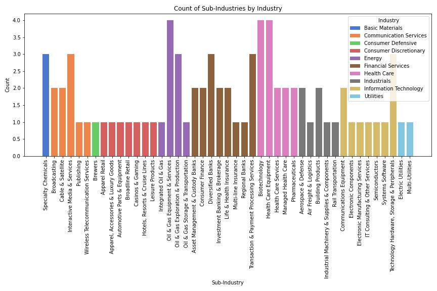

# superinvestors-database
Analysis of superinvestors transactions for the last 5 years extracted from Dataroma.com

# data visualizations

These are some examples of uses for the superinvestors database,

## Selected funds, quarterly trading activity 

This chart illustrates the trading activity for the selected funds

  

## Top 3 investors for NVIDIA activity 

This chart illustrates the trading activity for a selection of funds

  

## Top 3 investors for AMD activity 

This chart illustrates the trading activity for a selection of funds

  

## Total Activity by Fund

This chart shows the total activity by fund, displaying the top 20 funds by total shares.

## Activity by Industry

This chart illustrates the sub-industry activity by industry 

